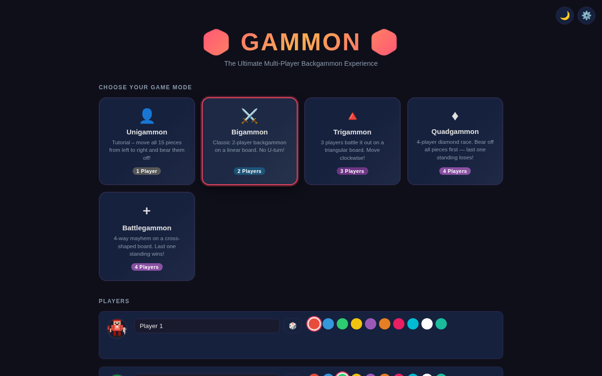
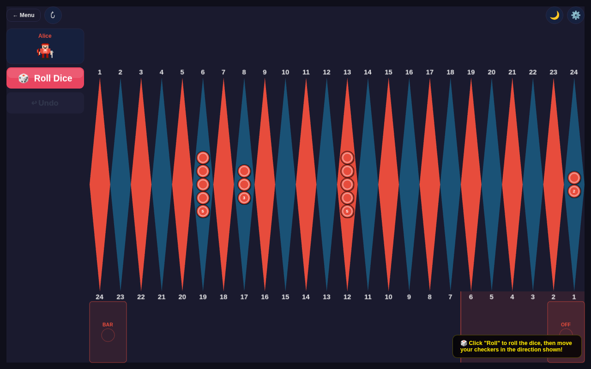
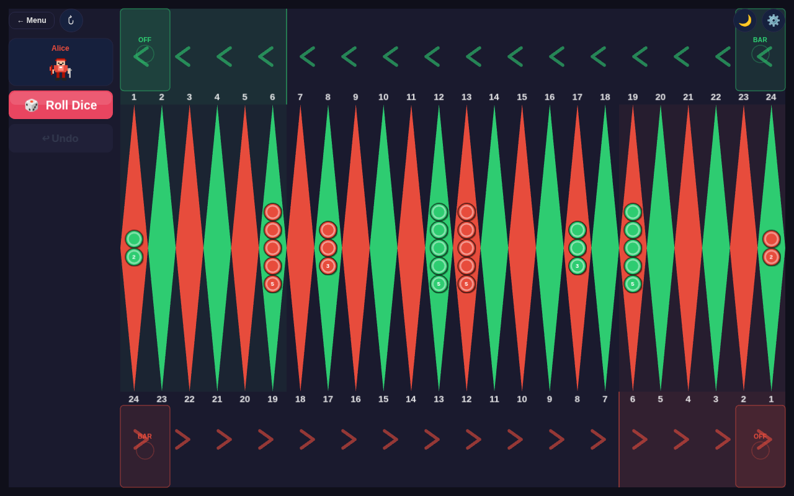
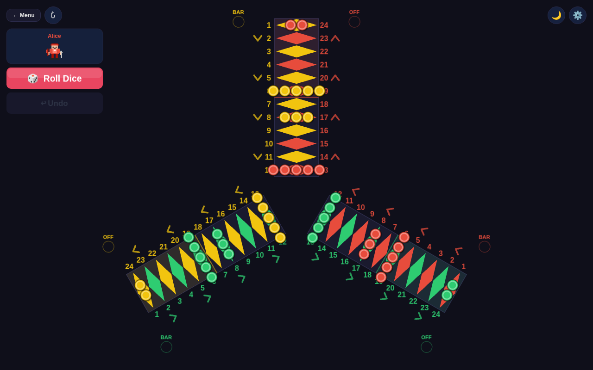
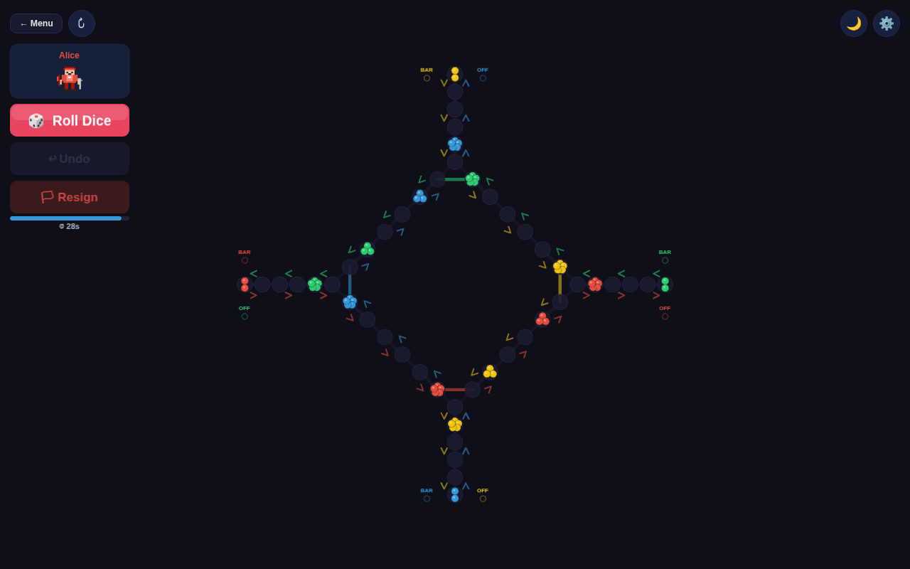
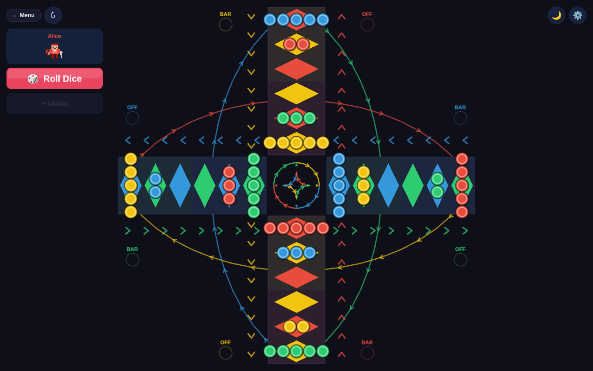

# Gammon

**The Ultimate Multi-Player Backgammon Experience** — 1-to-4 player backgammon in the browser, rendered with PixiJS (WebGL). Supports local and online peer-to-peer multiplayer.

## Game Modes

| Mode | Players | Board Shape | Description |
|---|---|---|---|
| **Unigammon** | 1 | Linear strip | Tutorial — bear all 15 pieces off the right end |
| **Bigammon** | 2 | Linear strip | Classic backgammon on a 24-point linear board |
| **Trigammon** | 3 | Y-shaped | Three-player battle on a triangular board, move clockwise |
| **Quadgammon** | 4 | Diamond | Four-player race on a diamond board; each player enters at a corner and bears off at the opposite corner |
| **Battlegammon** | 4 | Cross / plus | Four-way last-standing battle on a cross-shaped board; hit opponents to send them to the bar |

## Screenshots

### Setup Screen


### Unigammon — 1 Player Tutorial


### Bigammon — 2 Player Classic


### Trigammon — 3 Player Triangle


### Quadgammon — 4 Player Diamond Race


### Battlegammon — 4 Player Last Standing


## Running Locally

**Prerequisites:** Node.js 18+

```bash
# Install dependencies
npm install

# Start the development server (http://localhost:8000)
npm run dev

# Build for production (output in dist/)
npm run build

# Preview the production build locally
npm run preview
```

Open [http://localhost:8000](http://localhost:8000) in your browser.

## Online Multiplayer (P2P)

Gammon supports zero-backend browser-to-browser multiplayer via WebRTC (PeerJS):

1. On the setup screen, scroll to **🌐 Play Online** and click **Create Online Room**.
2. Share the generated link with your opponent(s).
3. Configure players and click **New Game** — guests join automatically.
4. Your player number and colour are shown in the top-right corner during online games.
5. The **Roll** button and board are locked when it is not your turn.

See [`p2p.html`](p2p.html) (served with the app) for a full interactive explainer including system diagram, turn flow, message protocol, and state machines.

### How it works (summary)

```
Host browser                PeerJS cloud (STUN only)            Guest browser
     |                              |                                  |
     |── new Peer() ───────────────>|                                  |
     |<─ peerId assigned ───────────|                                  |
     |                              |<─── new Peer() ─────────────────|
     |                              |<─── peer.connect(hostPeerId) ───|
     |<════ WebRTC DataChannel (direct, no server) ══════════════════>|
     |                              |                                  |
     |<─ { type:'request_state' } ──────────────────────────────────|
     |── { type:'assign', playerIndex:1, save:{…} } ───────────────>|
```

**Message types** (all JSON over reliable SCTP):

| `type` | Direction | Purpose |
|---|---|---|
| `assign` | Host → Guest | Seat number + full game snapshot |
| `state` | Any → All | Full game snapshot after a confirmed move |
| `waiting` | Host → Guest | Game not yet started |
| `request_state` | Guest → Host | Catch-up / reconnect request |
| `hit` | Any → All | Trigger elimination animation on all peers |

**Turn flow:** after a player uses their last die, `_pendingConfirm = true` and a green **✓ End Turn** button appears.  The state is only broadcast when the player clicks it — allowing undo before committing.  The host rebroadcasts every `state` it receives so all peers stay in sync.

**Seat persistence:** the guest's `{ roomId, playerIndex }` is stored in `localStorage` (2-hour TTL).  On page reload the guest includes `claimedIndex` in `request_state` and the host restores the seat if it is free.

## How to Play

1. **Choose a game mode** from the setup screen.
2. **Name your players** (or use the auto-generated funny names) and pick colours.
3. Click **New Game** to start.
4. On your turn, click **Roll** to roll the dice, then click a checker to select it and click a valid destination point.
5. Bear all your checkers off the board to win.

### Controls

| Control | Action |
|---|---|
| Click checker | Select it |
| Click highlighted point | Move selected checker there |
| **Roll** button | Roll dice at the start of your turn (greyed out when not your turn in online games) |
| **↩** (Undo) | Undo the last move within a turn (disabled in online games) |
| **↻** (Flip) | Flip the board view (Bigammon only) |
| **🌙 / ☀️** | Toggle dark / light theme |
| **⚙️** | Open settings (elimination animations, sound) |
| **← Menu** | Return to the setup screen |

## Architecture

```
js/
├── main.js          — Orchestrator: wires UI events to game logic, drives the turn loop
├── game.js          — BackgammonGame class: all rules, move validation, bar/borne-off logic
├── pixi-renderer.js — BoardRenderer: PixiJS v8 WebGL renderer, hit-testing, theme switching
├── p2p-engine.js    — NetworkManager: zero-backend P2P multiplayer via PeerJS/WebRTC
├── ui.js            — UIManager: DOM screens (setup / game / win), player forms
├── constants.js     — Game mode definitions, player colors, theme palettes
├── textures.js      — Procedural texture generation (wood grain, glossy checkers)
├── animation.js     — TweenManager hooked into PixiJS ticker
├── pixelart.js      — Pixel-art avatar drawing and elimination animations
├── names.js         — generateFunnyName() for auto-named players
└── layouts/
    ├── linear.js    — Bigammon / Unigammon: 24-point horizontal strip with BAR / OFF zones
    ├── triangle.js  — Trigammon: Y-shaped board, 36 diamond points across 3 arms
    ├── cross.js     — Battlegammon: cross-shaped board, 4 arms, corner path arrows
    ├── diamond.js   — Quadgammon: diamond board, 48 tiles, 4 player race with coloured shortcuts
    └── shared.js    — Shared helpers: dice HUD strip, arm highlights, chevrons, pip stacks
```

## Tech Stack

- **[PixiJS v8](https://pixijs.com/)** — WebGL 2D rendering
- **[Vite](https://vitejs.dev/)** — Dev server and production bundler
- Vanilla JS (ES modules), no framework

## Support

If you enjoy Gammon, consider [buying me a coffee](https://buymeacoffee.com/nabeelvandayar)!
